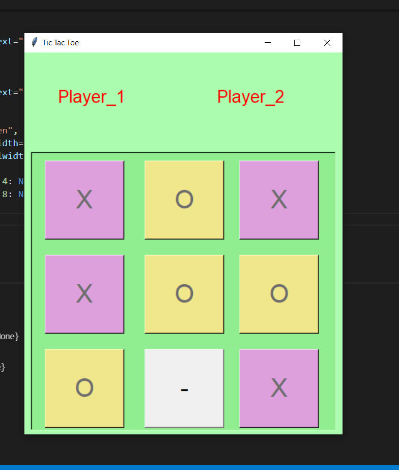

# Python-Tic-Tac-Toe-game-Tkinter

This is a simple Gui Based Tic Tac Toe created using complete python. Since python has a built in tkinter library which allows us to write GUI application directly, 

## there Are two Players who are going to play 

Player one is going to get X choices
Player two is going to get O choices

each player will get the turn every other time when opponent player playes. The player who ever matches all the X buttons in three sequential list , the player will win the match.

#### since each everything was developed using simple python code ,
